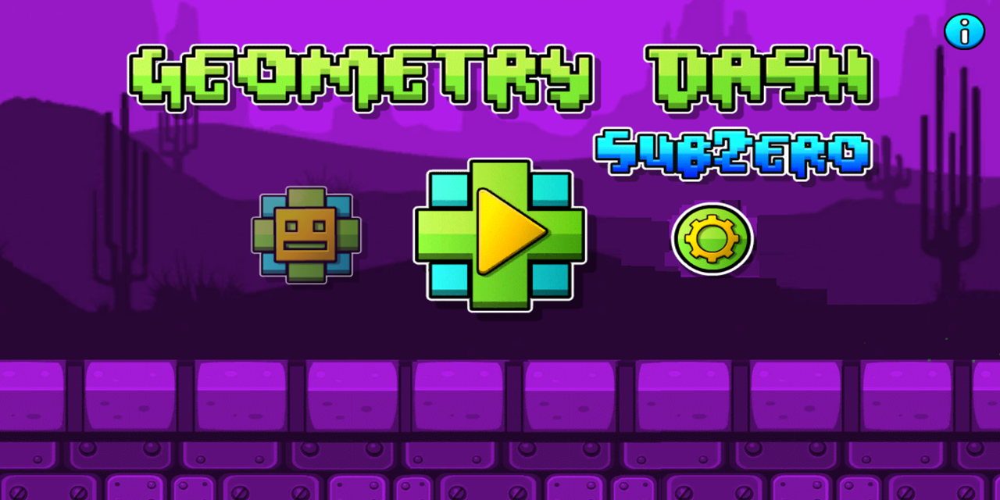
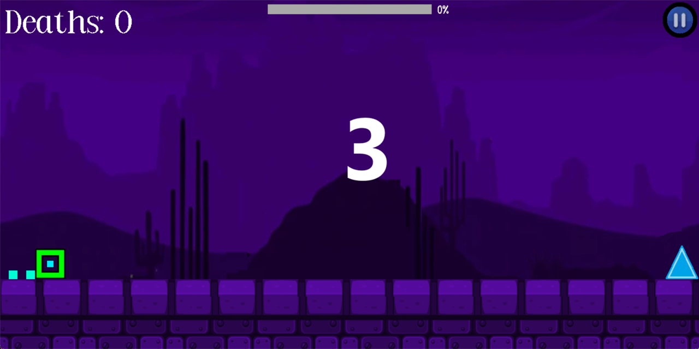
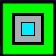
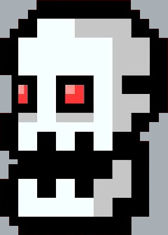

 # ***GEOMETRY DASH SUBZERO*** 

## **Introduction** 

+ Họ và tên: Lê Tuấn Cảnh - K68CB - UET

+ Mã sinh viên: 23020013 

+ Bài tập lớn: **Geometry Dash SubZero** (INT2215_50 - Lập trình nâng cao)
# Phụ lục
- [Description](#description)
  * [Game description and instruction](#game-description-and-instruction)
  * [Control](#control)
  * [Preview](#preview)
- [Objects In game](#objects-in-game)
- [Setup](#setup)
- [Play Game](#play-game)
- [See also](#see-also)
  * [Các kỹ thuật sử dụng](#các-kỹ-thuật-sử-dụng)
  * [Các nguồn tham khảo](#các-nguồn-tham-khảo)
- [Source Code Game](#source-code-game)
- [Conclusion](#conclusion)
  * [Điều tâm đắc](#điều-tâm-đắc)
  * [Hạn chế](#hạn-chế)
- [A Special Thanks To](#a-special-thanks-to)
- [Mức điểm tự đánh giá](#mức-điểm-tự-đánh-giá)

## **Description** 
### *Game description and instruction* 
- Chào mừng bạn đến với thế giới của Geometry Dash SubZero! Đây là một cuộc phiêu lưu đầy màu sắc và thách thức, nơi mà tốc độ và kỹ năng được đặt lên hàng đầu.
- Geometry Dash SubZero là một trò chơi được lấy cảm hứng từ game gốc Geometry Dash, nơi người chơi sẽ được trải qua một cuộc hành trình đầy kích thích qua các cấp độ độc đáo và đầy màu sắc. Tại đây, bạn sẽ phải vượt qua hàng loạt các chướng ngại vật, nhảy qua các chỗ trống và tránh các vật cản để tiến xa nhất có thể.
- Với đồ họa 2D và âm nhạc bắt tai, Geometry Dash SubZero hứa hẹn sẽ mang đến cho bạn một trải nghiệm điều khiển và phản xạ nhanh nhạy.
- Hãy chuẩn bị sẵn sàng cho một cuộc phiêu lưu đầy thách thức và hấp dẫn! Hãy cùng tham gia Geometry Dash SubZero và chứng tỏ kỹ năng của bạn qua mỗi bước nhảy và mỗi chướng ngại vật!
### *Control* 

| Control    |   Player   |
|------------|------------|
| UP         |      ↑     |
| SPACE      |      ↑     |

- **left mouse**: control Menu.
- **Button P**: Pause game.
- **Button ESC** : exit window.

### *Preview*
#### *Cửa sổ hiện thị màn hình Start Game*

#### *Cửa sổ hiện thị màn hình chọn map*

#### *Cửa sổ hiện thị đếm ngược trước khi nhân vật di chuyển*

## **Objects In game**
|                                         | Tên đối tượng 	       | Mô tả                                                                                        |
|-----------------------------------------|--------------------|--------------------------------------------------------------------------------------------------|
|  | Khối lập phương  | Dạng Normal của nhân vật chính, có khả năng nhảy lên và quay 1 vòng|
|  | Khối tròn xoay| Dạng Round của nhân vật chính, có khả năng bám lên tường trên, tốc độ di chuyển nhanh, luôn xoay tròn|
|  | Tên lửa | Dạng Rocket của nhân vật chính, bay trong không gian, nhưng chỉ có 2 trạng thái đi lên 1 góc 45' và lao xuống 1 góc 45'|
|  | Phi thuyền | Dạng Flappy của nhân vật chính, bay trong không gian, mô tả giống game Flappy Bird, di chuyển lên và thả tự do rơi có gia tốc |
|  | Boss |Xuất hiện cuối game, có khả năng bắn tia laser hạ gục nhân vật |
|  | Đinh, gai |Xuất hiện rải rác, gây mất mạng cho nhân vật |
|  | Bánh xe| Gây mất mạng cho nhân vật|
|  |Hố nước| Rơi xuống gây mất mạng cho nhân vật|
||Dung nhan| Rơi xuống sẽ làm chết nhân vật|
||Ô nhảy| Nhảy lên trên nhân vật đứng được, và không nhảy sẽ va chạm và gây chết nhân vật|
||Ô không gian| Nếu chạm vào ô này mà không nhảy lên thì sẽ rơi xuyên qua|
| |Ô nhảy tự động| Nhảy lên trên nhân vật đứng được, và không nhảy sẽ va chạm và gây chết nhân vật|
||Đất | Nhân vật di chuyển trên đó|
|  |Cổng không gian| Chuyển đổi giữa các dạng của nhân vật chính|
|  |Nút bắt đầu chọn map| bắt đầu mở ra trò chơi|
|  |Nút dừng trò chơi| Dừng mọi thông số nhân vật, giữ nguyên màn hình trò chơi|

## **Xây dựng map dựa trên con số, vẽ trên Excel**

## **Setup**
- Yêu cầu : có C++ compiler.
    1. Tạo một New Folder bất kỳ, dùng terminal: $ git clone https://github.com/bacbahieu/lemon.git
    2. Vào thư mục vừa tải về và ấn đúp vào Lemon.
    3. Ấn đúp vào GameSDL26_2.sln, sau khi vào trường trình nhấn tổ hợp Ctrl + F5 để chạy chương trình.
- *Mọi khó khăn trong phần cài đặt, trong quá trình chơi, vui lòng liên hệ qua 23020013@vnu.edu.vn.*

### *Các kỹ thuật sử dụng*  
- Thư viện SDL2.0
- Sử dụng nhiều class, vector, tách file, con trỏ, xâu chuỗi,biến, vòng lặp, cấu trúc rẽ nhánh, mảng, ...
- Tạo nhiều đối tượng với từng class riêng: chướng ngại vật, boss, map, xử lí ảnh ...
- Xử lý thời gian, thao tác chuột và bàn phím, âm thanh, hình ảnh, chữ.
- Tạo Option khi chơi : pause game, play game, restart game, exit game.
- Sử dụng paint để edit các ảnh dựa vào một số mẫu ảnh từ các nguồn khác.
- Xây dựng va chạm, ô map, dựa trên hệ tọa độ Oxy.
- Lấy nhân vật là trung tâm màn hình và di chuyển map chạy qua nhân vật.

### *Các nguồn tham khảo*
- Cách sử dụng, cài đặt SDL2.0 trên C++: tham khảo từ các bạn, kênh youtube **Phát Triển Phần Mềm 123A-Z**.
- Cách sử dụng, thư viện SDL2.0, quản lý chương trình:
    + Kênh youtube: **Phát Triển Phần Mềm 123A-Z**. ( Tham khảo cách xây dựng chương tình game, những tài nguyên cần thiết để tạo ra 1 chương trình game)
    + Tham khảo trên **LazyFoo**.
    + Các buổi học lý thuyết của **TS.Lê Đức Trọng**.
    + Các buổi học thực hành của **CN. Trần Trường Thủy**.
    + **ChatGPT**: giúp tôi hiểu rõ các hàm SDL_. 
- Hình ảnh: các nguồn trên google, web game onl,..
    + https://geometrydashsubzero.net/
- Âm thanh: các nguồn trên google
    + https://tiengdong.com/
    + https://www.youtube.com/watch?v=0wmOR496AWw
    + https://www.youtube.com/watch?v=5TWdxxW-6xc
    
## **Source Code Game**
- Folder *font*: Chứa toàn bộ kiểu định dạng chữ .
- Folder *img*: Chứa toàn bộ tài liệu của trò chơi.
- Folder *map_2*: Chứa toàn bộ hình ảnh của các ô tile map trong trò chơi.
- Folder *Header Files*: Chứa hầu hết các thư viện xử lý từng thành phần của trò chơi.
  + Header *BaseObject.h*:chứa hầu hết các lệnh để load ảnh và vẽ lên renderer, window.
  + Header *LText.h*: Tham khảo tại http://lazyfoo.net, để tạo ra chữ lên màn hình game.
  + Header *BossObject.h*: Xử lý phần dữ liệu của boss + laser bắn từ boss gồm tọa độ, render ảnh, tạo laser từ màu có sẵn trong SDL, xử lí việc há miệng của boss, căn thời điểm bắn laser, chuyển động lên xuống của boss...
  + Header *CommonFunc.h*: Chứa tất cả các thư viện, dữ liệu, thông số, hằng số, cần cho cả chương trình game.
  + Header *game_map.h*: Quản lý toàn bộ về việc xây dựng ô bản đồ, vẽ ô bản đồ.
  + Header *ImpTimer*: Quản lý thời gian của game.
  + Header *MainObject.h*: Chứa logic chính của nhân vật game
      * Xử lý events: Xử lý các thao tác di chuyển của nhân vật nhận từ bàn phím.
      * Xử lý các chức năng của nhân vật: nhảy cao, tăng tốc,...
      * Xử lý các chế độ nhân vât: chuyển từ dạng này sang dạng khác 
      * Xử lý va chạm giữa nhân vật với ô tile map, với laser.
      * Xử lý vị trí, tọa độ nhân vật.
      * Tạo hiệu ứng đuôi ảnh nhân vật.
  + Header *Menu.h*: Xử lý chương trình.
- Folder *Source Files*: *Chứa tất cả các file .cpp viết toàn bộ mã code của các thành phần class khai báo trong file .h tương ứng.
 *File Main.cpp* chỉ khởi tạo cửa sổ, loading âm thanh, tạo menu, liên kết toàn bộ tài nguyê, từ nhân vật, boss, map,..

## **Conclusion**
### ***Điều tâm đắc***
  - Dự án này hoàn toàn là do em tự làm, không đi sao chép ở bất kì đâu.
  - Xây dựng tính năng nhân vật theo sở thích.
  - Hiểu được mô hình phát triển 1 phần mềm kiểu thác nước: Phân tích, thiết kế, lập trình, kiểm thử, vận hành và bảo trì.
  - Hiểu được cách dùng github.
  - Hiểu sơ sơ một số khía cạnh của lập trình hướng đối tượng: kế thừa, đa hình,...
  - Sau khi làm dự án này, em thấy mình đã cải thiện được nhiều kỹ năng trong việc tư duy và viết code, khả năng lên ý tưởng, sắp xếp chia tách file và các kỹ năng sử dụng paint, excel.
  - Học được cách setup môi trường, sử dụng thư viện ngoài (SDL2, SDL2_ttf, SDL2_mixer, SDL2_image, ...)
  - Cải thiện kỹ năng sử dụng class (constructor, destructor, member function,...).  
  - Học được kỹ thuật refactor code, duyệt mảng, sinh số ngẫu nhiên, giải phóng bộ nhớ động.
  - Cải thiện kỹ năng tối ưu hóa code bằng việc destructor các đối tượng trong mỗi class, khởi tạo và giải phóng bộ nhớ động, ... => Kiểm soát tốt RAM của game *TỐT*, đảm bảo mức tối đa là *100MB*
### ***Hạn chế*** 
  - Một số phần code chưa tối ưu
  - Chưa phát triển nhiều map
  - Chưa có đồ họa sắc net

### ***Hướng phát triển***
- Thêm nhiều loại vật phẩm có tính năng khác nhau: phóng to, thu nhỏ,..
- Thêm các chế độ điều chỉnh tốc độ để người chơi để có thể chọn tốc độ tùy thích, phù hợp với khả năng chơi của mình.
- Áp dụng hệ thống sử dụng tiền và nạp tiền:
    + Thêm cửa hàng để mua trang phục và tự tạo hình ảnh cho nhân vật.
    + Sử dụng tiền thưởng kiếm được từ việc nạp tiền hoặc đạt được lúc chơi game.
    + Người chơi nạp tiền vào game, số tiền sẽ chuyển vào tài khoản nhà phát hành.
- Sử dụng kết nối mạng máy tính (LAN, Router,...) kết nối người chơi cạnh tranh với nhau.
  
# **A Special Thanks To**
- **TS. Lê Đức Trọng** - Người hướng dẫn, Giảng viên.
- **CN. Trần Trường Thủy** - Người hướng dẫn, Giảng viên.
- **SV Nguyễn Hoàng Dương** - Cố vấn.
- **Các bạn cùng phòng G214** - Người hỗ trợ, góp ý.
